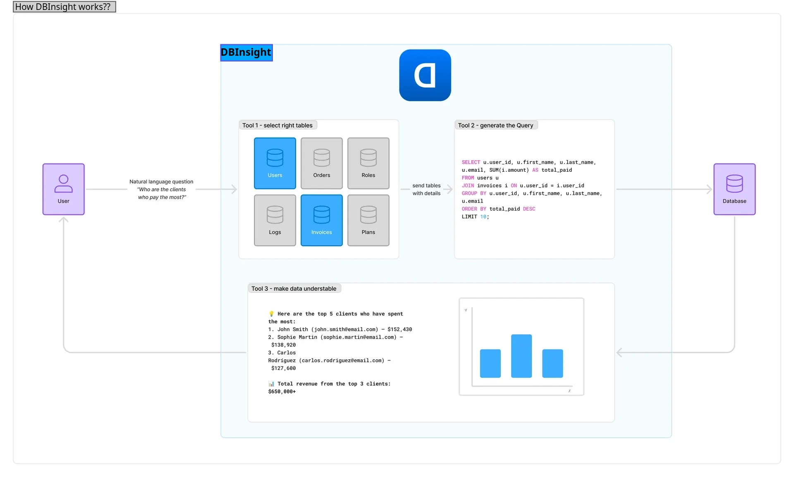

# DBInsight

**DBInsight** is a Python-based web application that allows you to interact with your databases using natural language. Simply connect to your database and start asking questions about your data in plain English.

## Technologies Used

- **Backend**: Python
- **Web Framework**: Flask
- **Frontend**: HTML, CSS, JavaScript

## Installation

### Prerequisites

Ensure you have the following installed:

- Python 3.8 or higher
- pip (Python package installer)

### Steps

1. Clone the repository:

   ```bash
   git clone https://github.com/vaibhavraj-4/DBInsight.git
   cd DBInsight
   ```

2. Create and activate a virtual environment:

   ```bash
   python -m venv venv
   source venv/bin/activate  # On Windows, use `venv\Scripts\activate`
   ```

3. Install the required dependencies:

   ```bash
   pip install -r requirements.txt
   ```

4. Run the application:

   ```bash
   python app.py
   ```

The application will start, and you can access it in your web browser at [http://127.0.0.1:5000](http://127.0.0.1:5000).

## Screenshots

Here are some screenshots of DBInsight in action:

**DBInsight Flow Diagram**  


**App Home Page**  


**Supported DBs'**  


## Contributing

Contributions are welcome! To contribute:

1. Fork the repository.
2. Create a new branch (`git checkout -b feature-branch`).
3. Commit your changes (`git commit -am 'Add new feature'`).
4. Push to the branch (`git push origin feature-branch`).
5. Create a new Pull Request.

Please ensure your code adheres to the existing style and includes appropriate tests.

## License

This project is licensed under the MIT License - see the LICENSE file for details.
